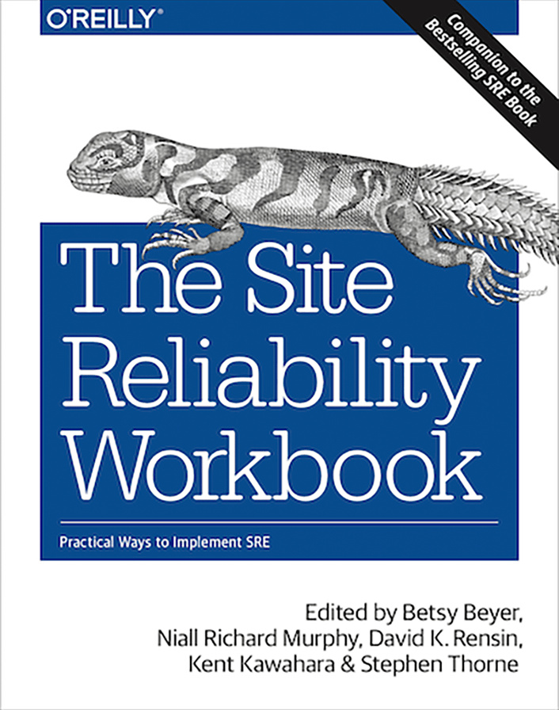

# Book of Kate's OceanBites Posts

Generates a EPUB/MOBI/PDF for the OceanBites posts by Katherine Barrett.

Original sources are downloaded from https://oceanbites.org/author/kbarrett/

Visit the [Releases](https://github.com/kingdonb/kate-ob-book/releases) page to download the latest release.

# Books

| OceanBites Posts Cover Image Here (2016)                                              | Post-mortem Documentation Blog ?? (20XX)                                               |
|:--------------------------------------------------------------------------------------|:---------------------------------------------------------------------------------------|
|  |  |

# Build

## Docker (Preferred)

Requirements:

-   Docker

You can generate either of books using `BOOK_SLUG` variable.

Available values for *`BOOK_SLUG`*:
  - `ob` Kate's OceanBites Posts
  - `postdoc` Another publication also someday maybe?

```
$ docker run --rm --volume "$(pwd):/output" -e BOOK_SLUG='ob' kingdonb/kate-ob-book:latest
```

-   You should see the final EPUB/MOBI/PDF files in the current directory after the above runs.
-   The file may be owned by the root user.

**NOTE:** You'll have to allow docker access to a directory that's local to your system. The safest way to do this is as follows:

```
$ mkdir /tmp/sreoutput
$ chcon -Rt svirt_sandbox_file_t /tmp/sreoutput
$ docker run --rm --volume "/tmp/sreoutput:/output" -e BOOK_SLUG='ob' kingdonb/kate-ob-book:latest
```

The build for the above Docker image can be audited at <https://cloud.docker.com/swarm/kingdonb/repository/docker/kingdonb/kate-ob-book/builds>.

## macOS

Review and run the `bootstrap.sh` script to generate the EPUB, MOBI, and PDF files

Requirements:

-   Ruby
-   `gem install bundler`
-   `bundle install`
-   `brew install pandoc`
-   `brew cask install calibre`
-   `brew install wget`

# Known Issues

-   metadata is not complete. There are just too many authors
-   Foreword/Preface is not part of the index

# LICENSE

This is licensed under WTFPL. See COPYING file for the full text.
